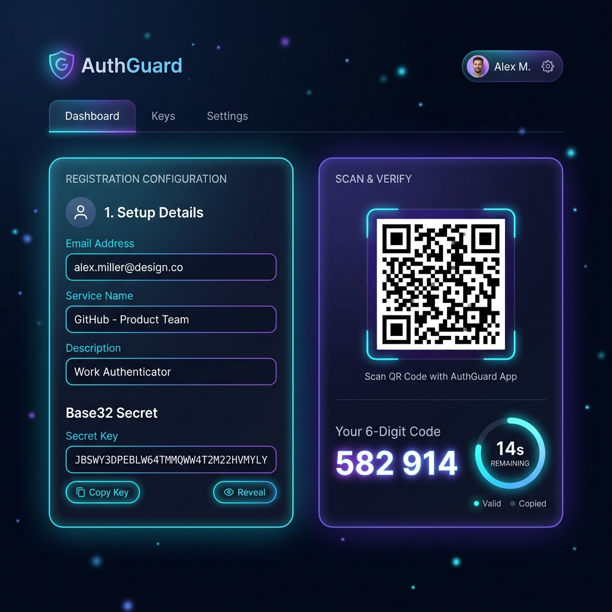
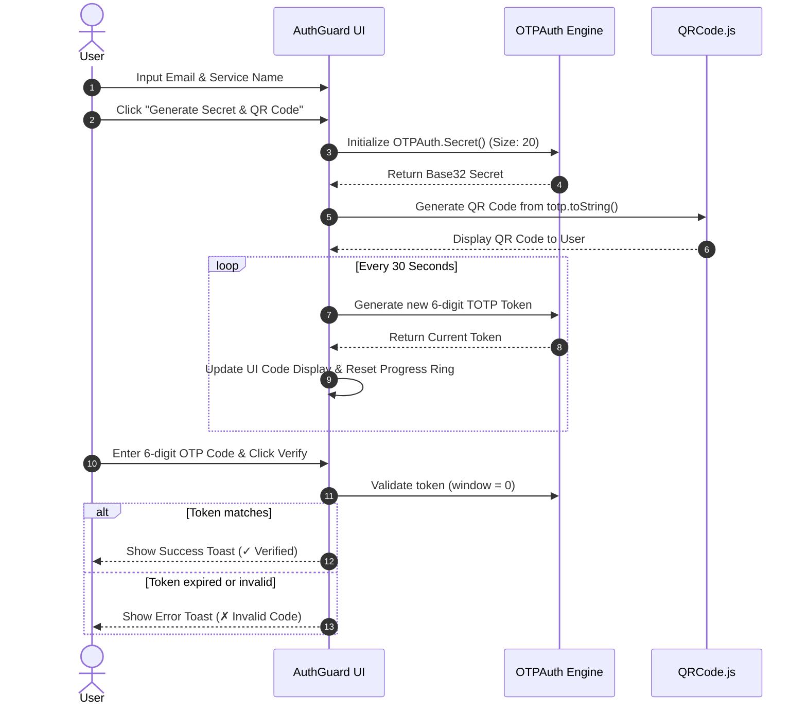

# 🔐 AuthGuard — Premium TOTP 2FA Authenticator

<div align="center">

[](#)
[](#)
[](#)
[](#)

A state-of-the-art, client-side Time-Based One-Time Password (TOTP) generator and verifier. Built with ultra-modern glassmorphic design and rich micro-interactions to deliver a premium authentication experience.

[Key Features](#key-features) • [Interactive Flow](#interactive-flow) • [Tech Stack](#tech-stack) • [Quick Start](#quick-start) • [Security Policy](#security-considerations)

<br>



</div>

---

## ✨ Features

- 🌌 **Premium Visual Architecture:**
  - Ambient floating glowing neon orbs that float smoothly in the background.
  - Interactive background particle canvas emitting customizable blue-purple elements.
  - Glassmorphic panels with sliding radiant borders on hover.
- ⚙️ **On-the-Fly Configuration:** Set custom service issuers (e.g., *Fudode*) and account emails. Secrets are generated in cryptographic Base32 format instantly.
- 📱 **Real-time Scan & Sync:** Outputs standard Key URI formatted QR codes using `QRCode.js`, readable by standard authenticator apps (Google Authenticator, Authy, Microsoft Authenticator, etc.).
- ⏳ **Interactive Countdown Ring:**
  - Standard 30-second token refresh intervals.
  - Custom SVG circular progress ring mapping remaining time.
  - Visual status cues: progress ring automatically shifts to **amber** at 10 seconds remaining, and **crimson red** at 5 seconds remaining.
- 🧪 **Instant Verification Sandbox:** Built-in validation field allowing you to type in the 6-digit code and verify it in real-time.
- 🔔 **Custom Toast notification engine:** Non-blocking CSS-animated alert toasts (Success, Warning, Error) complete with smooth progress indicators mapping their lifetime.

---

## 🔄 Interactive Flow

The diagram below details the end-to-end token generation and client-side verification flow:



---

## 🛠️ Tech Stack

AuthGuard is built with pure web technologies to ensure zero overhead, rapid loading speeds, and optimal client-side execution security.

| Layer | Technology | Details |
| :--- | :--- | :--- |
| **Core Architecture** | HTML5 Semantic markup | Clean structural code using modern document tags. |
| **Design System** | Custom CSS3 Properties | Glassmorphism, CSS keyframe animations, responsive grid. |
| **Verification Logic** | `otpauth.umd.min.js` | Industry-standard cryptographic RFC 6238 implementation. |
| **Visual Syncing** | `qrcode.min.js` | Fast QR generation using HTML Canvas / DOM rendering. |
| **Particles Engine** | HTML5 Canvas API | Lightweight JavaScript particles animation loop. |

---

## 🚀 Quick Start

Since AuthGuard is entirely client-side, setup is as simple as opening the file.

### 1. Run Locally
Simply open the `index.html` file in any modern web browser:
```bash
# Double-click index.html or run via command line
start index.html  # Windows
open index.html   # macOS
```

### 2. Live Server / Development
If you prefer running a local development server:
```bash
# Using Python's built-in HTTP server
python -m http.server 8000

# Using Node.js live-server
npx live-server
```
Visit `http://localhost:8000` (or the port specified by live-server) in your browser.

---

## 🛡️ Security Considerations

While AuthGuard provides an exceptional playground for understanding and configuring TOTP 2FA, remember the following guidelines for production deployments:

1. **Local Execution Only:** This application processes all secret configurations directly in your browser. No data is sent to external servers.
2. **Clock Synchronization:** TOTP relies heavily on time synchronization. Ensure the device running AuthGuard and the device hosting your Authenticator app have synchronized clocks (network time sync enabled).
3. **HTTPS Requirement:** When deploying to production web environments, ensure AuthGuard is served exclusively over **HTTPS** to protect key exchanges and inputs from potential MITM sniffing.
4. **Secret Storage:** Base32 secrets should never be logged or stored in plaintext on unsecured servers or public client directories.

---

<div align="center">

*Crafted with ❤️ by **[Krishna](https://github.com/krishnaxsys)** • Connect on **[LinkedIn](https://in.linkedin.com/in/krishna-kumar-verma-23070a260)***

</div>
